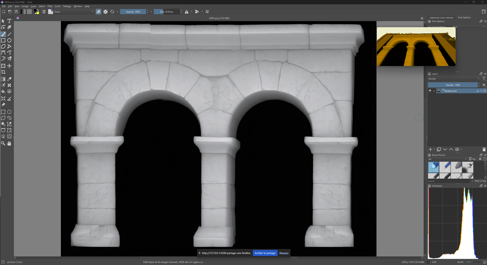

# µsini Depth Map Real Time 3D Viewer

# Use it here : https://usini.github.io/depth/

A real-time 3D depth map visualization tool built with Three.js. Load depth map images or capture your screen to create interactive 3D relief visualizations.   
No installation required!

https://github.com/user-attachments/assets/5b3162d5-6978-4fef-966f-f2e33e9603df

Support Picture In Picture preview for always on top 3D preview in any application


## Features

- **Image Loading**: Load local depth map images (PNG, JPG, etc.)
- **Screen Capture**: Capture your screen in real-time with configurable intervals
- **3D Visualization**: GPU-accelerated displacement mapping with Gaussian/Max kernel smoothing
- **Picture-in-Picture**: View the 3D canvas in a floating PiP window
- **Gold Filter**: Optional gold tint overlay for aesthetic effect
- **Persistent Settings**: Depth and capture interval settings are saved between sessions
- **Multi-language Support**: English and French included, easy to add more

## Screen Capture

1. Click **Start** to begin continuous screen capture
2. Select the screen, window, or tab you want to capture
3. The 3D view updates automatically at the specified interval
4. Click **Stop** to end capture

Use **Single Capture** for one-time captures without continuous updates.

## Controls

| Control | Description |
|---------|-------------|
| **Depth** | Adjusts the height/intensity of the 3D displacement (0-5) |
| **Capture interval** | Time between screen captures in milliseconds |
| **Gold filter** | Toggles a golden color tint on the visualization |
| **Picture-in-Picture** | Opens the 3D view in a floating window |
| **Language** | Switch between available languages |

### Mouse Controls

- **Left drag**: Rotate view
- **Right drag**: Pan view
- **Scroll**: Zoom in/out

## Adding a New Language

The i18n system makes adding translations simple:

1. Open `i18n.js`
2. Copy the `en` translation block
3. Paste it with a new language code (e.g., `es`, `de`, `ja`)
4. Translate all values
5. The language automatically appears in the selector

Example:
```javascript
es: {
    _name: 'Español',
    _flag: '🇪🇸',
    appTitle: 'Mapa de Profundidad',
    uploadLabel: 'Imagen local',
    // ... translate remaining keys
}
```

## Technical Details

- **Three.js** for WebGL rendering
- **Custom GLSL shaders** for GPU-based displacement mapping
- **Hybrid Gauss/Max kernel** for edge-preserving depth smoothing
- **LocalStorage** for settings persistence

## Browser Support

Requires a modern browser with:
- WebGL support
- ES6 modules
- Screen Capture API (for screen capture feature)
- Picture-in-Picture API (for PiP feature)

## AI Disclosure
This application was partly built using GPT4.1 and Claude Opus 4.5

## License
Made by [µsini](https://usini.eu)   
MIT License
